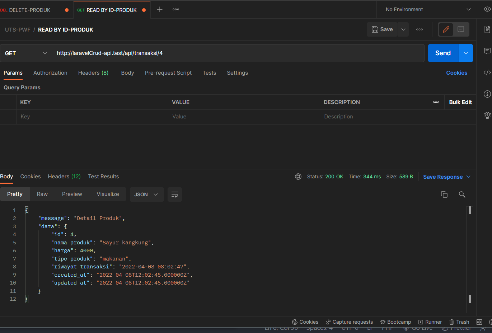

## API Transaksi Produk - UTS Pemrograman Web Framework

- Nama: Andri Maulana
- Kelas: IF20B
- NIM: 20416255201065

Happy Enjoy!👍
# Cara Instalasi Api
### Menjalankan Server API

1. Clone repositori ini.
1. Install XAMPP versi terbaru. Pastikan direktori PHP XAMPP sudah ada pada environment variable `PATH`.
2. Buka XAMPP. Nyalakan Apache dan MySQL.
3. Buka Phpmyadmin dan buat database baru yang bernama `crud-restapi`.
4. Silhakan import database yang bernama `crud-restapi.sql`.
5. Jalankan perintah `php artisan serve` untuk mengaktifkan development server.
# Testing API 
### Read Data (Melihat Data Transaksi)

## Read Data By ID ( Melihat Data Bersarkan ID )

### Add Data ( Menambahkan Datat Transaksi )

## Update Data ( Merubah Data Transaksi )

## Update Data ( Merubah Data Transaksi )

